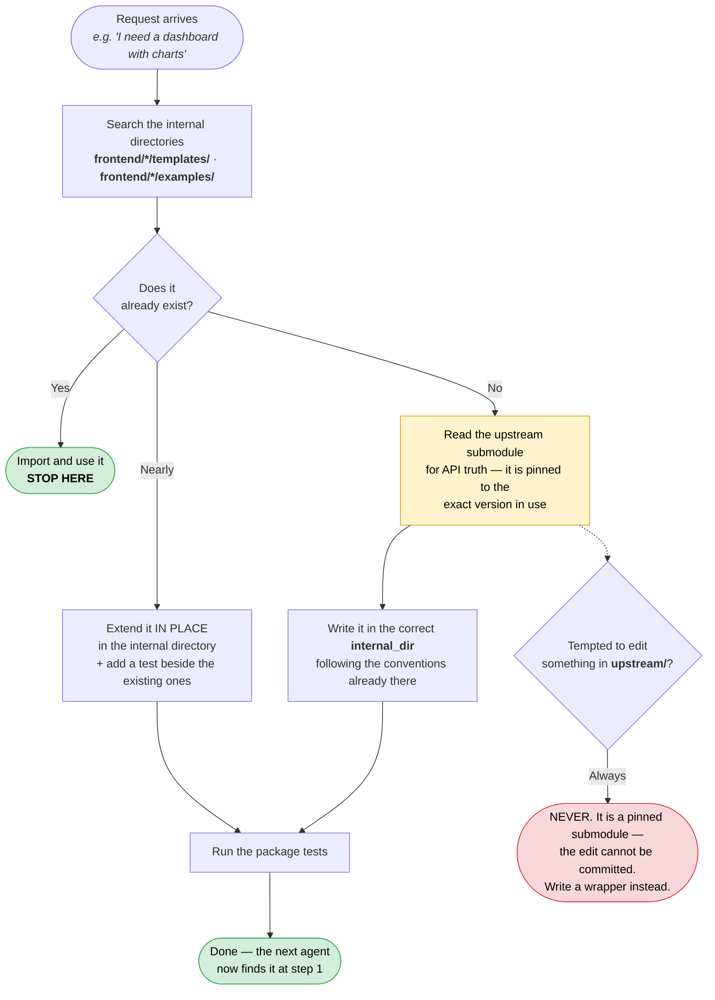

# Instructions for AI Coding Agents

You are working in the **Engineering Library**. Read this before writing code.

The purpose of this repository is that you **reuse what is already here instead
of rebuilding it**. When a developer says *"check the Engineering Library before
building this from scratch"*, this file tells you how.

---

## 1. Orient yourself in one file

[`sources.yml`](sources.yml) is the machine-readable registry and the source of
truth — **46 vetted frontend sources**. Parse it first. Each entry tells you:

| Field | What it tells you |
| --- | --- |
| `title`, `description` | what the technology is |
| `group` | which catalog section it belongs to |
| `use_when` / `avoid_when` | **whether to pick it for the task in front of you** |
| `alternatives` | what to use instead when it is the wrong fit |
| `tags` | keywords to match a request against (`table`, `auth`, `animation`, …) |
| `install` | the exact command that adds it to a product |
| `docs` | official documentation URL |
| `used_for` | what we use it for |
| `path` | where the **upstream** code is — read-only (`null` = not ingested) |
| `internal_dir` | where **our** code is — reusable and editable |
| `sync_method` | `git-submodule` = source is on disk · `reference-only` = install from npm |
| `coupling` | `type-coupled` = our code compiles against it |
| `upstream`, `ref` | the official repository and the branch we track |
| `license`, `license_ok` | whether we are allowed to use it |
| `enabled` | `false` means **do not use this source at all** |
| `maintenance_note` | a known maintenance risk you should surface to the user |

Human-readable views of the same data, regenerated from it:
[`docs/frontend-catalog.md`](docs/frontend-catalog.md) (everything available)
and [`docs/frontend-stack.md`](docs/frontend-stack.md) (what to pick, and the
house default stack).

**Before you add any npm dependency, check the registry.** If it is already
catalogued, use the catalogued one — it is licence-cleared and monitored. If it
is not catalogued, say so and prefer an alternative that is.

---

## 2. The one rule that matters

```
*/upstream/**      →  READ ONLY. Never edit. Never add files.
everything else    →  Normal code you may change.
```

Upstream directories are **git submodules**: they are pointers to specific
commits in someone else's repository. An edit there cannot be committed to this
repository — it will be silently lost, or it will fail CI. There is no exception
to this rule.

If you believe upstream needs changing, the correct action is to write a wrapper
in the `internal_dir`, or to open a PR against the real upstream project.

---

## 3. How to answer a request



Work through this in order. Stop at the first step that satisfies the request.

1. **Search the internal directories.** `frontend/*/templates/`,
   `frontend/*/examples/`. This is vetted, tested, house-style code.
   → *Found it?* Import and use it.
2. **Nearly fits?** Extend it **in place**, in the internal directory, and add a
   test next to the existing ones.
3. **Need to understand the underlying API?** Read the upstream submodule. It is
   the authoritative source for option names, types and behaviour — better than
   recalling it from memory, because it is pinned to the exact version in use.
4. **Genuinely new?** Write it in the appropriate `internal_dir`, following the
   conventions of the code already there.

**Do not** add a new npm dependency that duplicates a registered source. If the
request involves charts, use `chart.js` / `react-chartjs-2` — they are already
here, already licence-cleared, and already dependency-managed. The same applies
to tables (TanStack Table), forms (React Hook Form + Zod), toasts (Sonner),
command palettes (cmdk), drawers (Vaul), icons (Lucide) and animation (Motion).

**Do not copy code from a repository that is not in the registry**, and never
from one recorded as `enabled: false` — those are blocked because they carry no
licence grant, which makes copying them a legal problem rather than a style
preference.

---

## 4. Worked example

> **Request:** *"I need a dashboard with charts."*

```ts
// Both packages are internal, tested, and safe to use.
import {
  registerDashboardCharts,
  lineSeriesPreset,
  barComparisonPreset,
  buildLineData,
  PALETTE,
} from '@engineering-library/chartjs-examples';        // frontend/chartjs/examples

import { cn, buttonVariants, statusBadgeVariants }
  from '@engineering-library/shadcn-templates';        // frontend/shadcn/templates

registerDashboardCharts();                              // once, at app bootstrap

const data    = buildLineData(['Mon','Tue','Wed'], [{ label: 'Requests', data: [120, 180, 140] }]);
const options = lineSeriesPreset({ unit: ' req', legend: true });
// render with <Line data={data} options={options} /> from react-chartjs-2
```

What you did **not** do: pick chart colours by hand, hand-write an options
object, re-derive which Chart.js components need registering, or reimplement
`cn`. All of that is solved in the internal packages.

If a preset does not exist for the chart you need, add it to
`frontend/chartjs/examples/src/dashboard-presets.ts` with a test — so the next
agent finds it at step 1.

> **Request:** *"Add a customers table with search and pagination, and a form
> to invite a teammate."*

```ts
import { useReactTable } from '@tanstack/react-table';
import { useForm } from 'react-hook-form';
import { z } from 'zod';
import {
  clientTable, columnsFor, pageInfo, formatDate,   // table
  zodForm, email, applyServerErrors,               // form
} from '@engineering-library/data-patterns';       // frontend/data/patterns

const col = columnsFor<Customer>();
const table = useReactTable(clientTable({ data: customers, columns: [
  col.accessor('name',      { header: 'Name' }),
  col.accessor('createdAt', { header: 'Joined', cell: (c) => formatDate(c.getValue()) }),
]}));
const { from, to, total } = pageInfo(table.getState().pagination, customers.length);

const inviteSchema = z.object({ email, role: z.enum(['admin', 'member']) });
const form = useForm(zodForm(inviteSchema, { email: '', role: 'member' }));
```

What you did **not** do: choose a page size, write a `sorting → ?sort=` mapper,
write an email regex, invent a password rule, or wire a Zod resolver by hand.
Render it with the shadcn/ui data-table and form blocks.

> **Request:** *"Add Stripe subscriptions."*

Read `frontend/starters/upstream/saas-starter/` first — checkout, webhook
handling and the customer portal are implemented there, MIT-licensed, at a
pinned commit. Adapt that, do not invent it.

---

## 5. Where things are

| Need | Path | Editable |
| --- | --- | --- |
| Chart presets, palette, Chart.js registration | `frontend/chartjs/examples/src/` | ✅ yes |
| `cn()`, button/badge variants | `frontend/shadcn/templates/src/` | ✅ yes |
| Table state, form + Zod helpers, formatters | `frontend/data/patterns/src/` | ✅ yes |
| Chart.js API truth (options, scales, plugins) | `frontend/chartjs/upstream/Chart.js/` | ❌ **no** |
| React chart component props | `frontend/chartjs/upstream/react-chartjs-2/` | ❌ **no** |
| shadcn component anatomy and conventions | `frontend/shadcn/upstream/ui/` | ❌ **no** |
| TanStack Table / React Hook Form / Zod API truth | `frontend/data/upstream/` | ❌ **no** |
| Accessibility + keyboard behaviour (Radix, Headless UI) | `frontend/headless/upstream/` | ❌ **no** |
| cmdk, Sonner, Vaul, resizable panels source | `frontend/interaction/upstream/` | ❌ **no** |
| **Whole applications to copy patterns from** (Stripe billing, auth, teams, RSC cart, dashboard shells) | `frontend/starters/upstream/` | ❌ **no** |
| Which library to use for a task | `docs/frontend-stack.md`, `docs/frontend-catalog.md` | ⚠️ catalog is generated |
| Sync automation | `scripts/`, `.github/workflows/` | ⚠️ only on request |
| Registry | `sources.yml` | ⚠️ see below |

**The starters are the biggest shortcut in this repository.** When a user asks
for something a production application already solves — Stripe subscriptions
and webhooks, session auth, team/role models, a storefront cart, a dashboard
shell — read the implementation in `frontend/starters/upstream/` before writing
one. It is real, working, MIT-licensed code pinned to an exact commit.

If an upstream directory looks empty, submodules are not checked out. Run:

```bash
git submodule update --init --recursive
```

---

## 6. If you add a source to the registry

Only do this when explicitly asked. Then you must:

1. `npm run vet -- owner/repo` — verify the licence, maintenance status and
   repository weight **against the GitHub API, not from memory**.
   **No LICENSE file means no permission** — set `enabled: false` and record
   `blocked_reason`. Do not ingest it.
2. Decide the tier the vetting output suggests:
   - `git-submodule` — reading the source is useful and the repo is small
     enough to clone in CI. Then:
     `git submodule add --depth 1 -b <branch> <url> <category>/<tech>/upstream/<name>`
   - `reference-only` — consumed from npm, or too heavy. No submodule; set
     `path: null`.
3. Add the `sources.yml` entry (all required fields, including `group`,
   `coupling`, `docs`, `use_when` and `avoid_when`).
4. Run `npm run docs:render` — never hand-edit the generated docs.
5. Run `npm run validate` and confirm it passes.

Full detail: [`docs/adding-a-source.md`](docs/adding-a-source.md).

---

## 7. Checks you can run

```bash
npm run validate          # registry + generated docs + licences
npm run check:upstream    # how far behind upstream each ingested source is
npm run check:catalog     # are the catalogued (npm-installed) sources still healthy?
npm run vet -- owner/repo # vet a candidate before proposing it
cd frontend/chartjs/examples   && npm test
cd frontend/shadcn/templates   && npm test
cd frontend/data/patterns      && npm test
```

Never "fix" a failing upstream sync by editing files inside `upstream/`.
