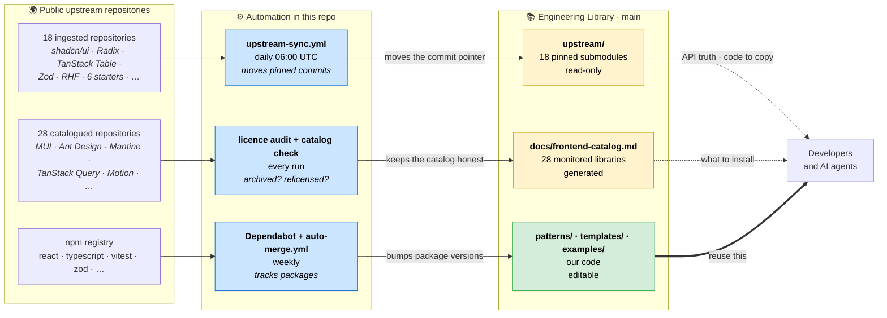
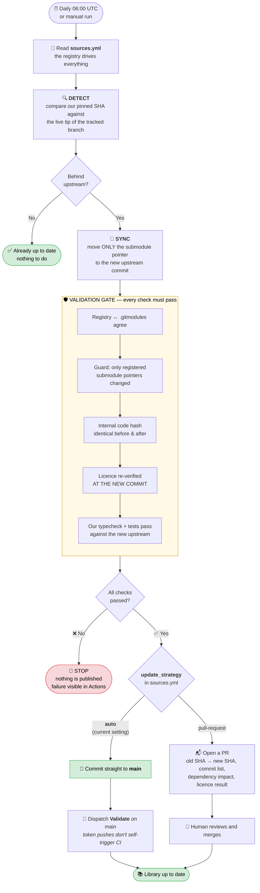
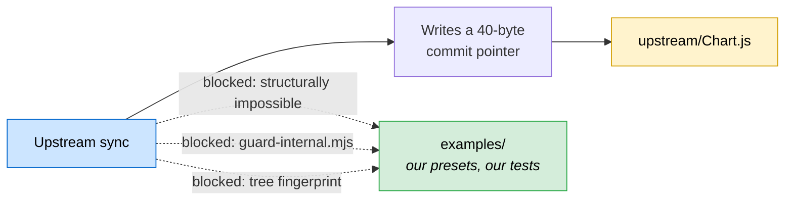
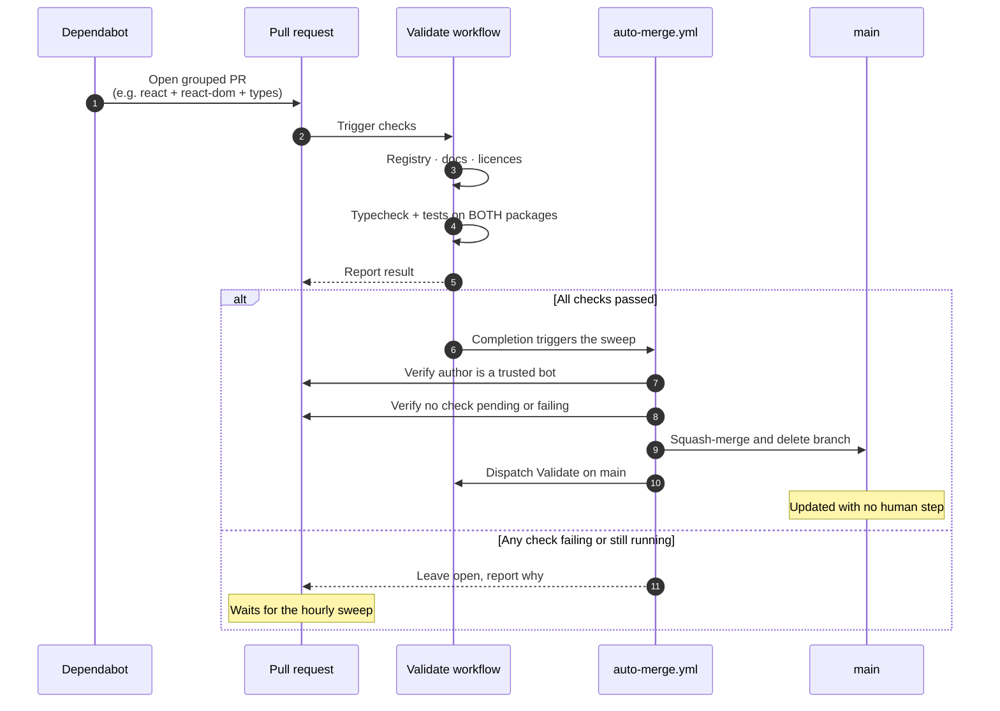

# Engineering Library

A **living, version-controlled library of vetted engineering sources** that stays
connected to the public repositories it is built on.

This is not a folder of copied GitHub code. Every external technology here is
attached to its official upstream repository by a **pinned git submodule**, and
an automated pipeline detects when that upstream moves, validates the change,
and opens a pull request for a human to review.

> **Current scope:** frontend — **46 vetted sources**: component systems,
> headless primitives, tables, forms, charts, motion, and six production
> starter applications. The architecture is category-agnostic; `backend/`,
> `ai/`, `database/`, `integrations/`, `infrastructure/` slot in without
> redesign.

### Start here

| You are… | Read |
| --- | --- |
| A developer starting a feature or a product | **[`docs/frontend-stack.md`](docs/frontend-stack.md)** — what to use, and what to clone instead of building |
| Looking for a specific library | **[`docs/frontend-catalog.md`](docs/frontend-catalog.md)** — all 46, with licences, install commands, and when *not* to use each |
| An AI coding agent | **[`AGENTS.md`](AGENTS.md)** |
| Reviewing licence compliance | [`docs/upstream-sources.md`](docs/upstream-sources.md) |

---

## Table of contents

- [Why this exists](#why-this-exists)
- [What is in the library](#what-is-in-the-library)
- [How upstream repositories are connected](#how-upstream-repositories-are-connected)
- [Repository layout](#repository-layout)
- [The golden rule: upstream vs internal](#the-golden-rule-upstream-vs-internal)
- [How synchronisation works](#how-synchronisation-works)
- [Dependency management](#dependency-management)
- [For developers](#for-developers)
- [For AI coding agents](#for-ai-coding-agents)
- [Adding a new upstream source](#adding-a-new-upstream-source)
- [What you must not modify](#what-you-must-not-modify)
- [Licensing](#licensing)

---

## Why this exists

Teams repeatedly solve the same problems — a dashboard chart, a button variant,
a form pattern — by starting from scratch or by copy-pasting a snippet from a
GitHub repository that then rots in place, disconnected from its source.

This library fixes both halves of that problem:

| Problem | How this library solves it |
| --- | --- |
| "We rebuilt something that already exists." | A small, curated set of vetted sources, documented and searchable. |
| "Our copy is two years behind upstream." | Automated daily drift detection against the real upstream branch. |
| "Nobody knows where this code came from." | Every source has a machine-readable upstream URL, tracked branch and pinned commit. |
| "Updating upstream wiped our changes." | Upstream and internal code are in separate directories, and the separation is enforced by CI. |
| "We copied code we had no licence for." | Licences are verified before ingest and re-verified on every sync. |
| "Everyone picks a different table library." | One catalog with a recommended default per job, and the reasoning written down. |

---

## What is in the library

**46 sources, every one vetted against the GitHub API** — licence, maintenance
status and repository weight — before it was added, and re-checked
automatically afterwards.

| Group | Contents |
| --- | --- |
| **Component systems** | MUI · Ant Design · Mantine · Chakra UI · PrimeReact · HeroUI |
| **Tailwind-native** | shadcn/ui · daisyUI · Flowbite React · Magic UI · Tremor |
| **Headless / accessibility** | Radix Primitives · Headless UI · React Aria · Base UI · Ark UI |
| **Data, forms, state** | TanStack Table · Query · Router · Virtual · React Hook Form · Zod · Zustand |
| **Charts** | Chart.js · react-chartjs-2 · Recharts · ECharts |
| **Motion, icons, interaction** | Motion · Lucide · dnd kit · Tiptap · cmdk · Sonner · Vaul · resizable panels |
| **Starter applications** | Next.js SaaS Starter · next-enterprise · Next.js Boilerplate · Next.js Commerce · Taxonomy · create-t3-app · Refine |
| **Platform** | Next.js · Tailwind CSS · Storybook · Playwright |

Sources are ingested at one of two tiers, and the registry records which and
why:

| Tier | Count | What it means |
| --- | --- | --- |
| **`git-submodule`** | 18 | The upstream code is on disk at a pinned commit — read it, copy from it, never edit it. Chosen where reading the source is genuinely useful and the repository is small enough for CI. |
| **`reference-only`** | 28 | No code ingested. Catalogued with docs, install command and house guidance; monitored for archival, relicensing and releases. Chosen for anything installed from npm, or too heavy to clone (Ant Design alone is 281 MB). |

Two repositories were **evaluated and rejected** on licence grounds. They stay
in the registry so the decision is auditable — see
[Licensing](#licensing).

**Our own reusable code** lives beside them, tested and typed against the
pinned upstream:

| Package | What you get |
| --- | --- |
| [`frontend/data/patterns`](frontend/data/patterns) | Table state and query mapping, Zod + React Hook Form wiring, field schemas, cell formatters |
| [`frontend/chartjs/examples`](frontend/chartjs/examples) | Dashboard chart presets, palette, Chart.js registration |
| [`frontend/shadcn/templates`](frontend/shadcn/templates) | `cn()`, button and status-badge variants |

---

## How upstream repositories are connected

**Every upstream source is a pinned git submodule.** We do not copy, vendor or
fork upstream code.

A submodule stores two things in our repository:

1. the upstream URL, in [`.gitmodules`](.gitmodules)
2. a 40-character commit SHA — the exact upstream revision we point at

That is the entire footprint. Browse to
[`frontend/chartjs/upstream/Chart.js`](frontend/chartjs/upstream/Chart.js) on
GitHub and you will see a link straight to `chartjs/Chart.js` at that commit.
The relationship is native to git, not reconstructed from a manifest.

**Why submodules rather than the alternatives** — the reasoning is written up in
[`docs/architecture.md`](docs/architecture.md#why-submodules). In short:

| Approach | Verdict |
| --- | --- |
| Copy / vendor the files | ✗ Breaks the upstream link. Explicitly what this project must not be. |
| `git subtree` | ✗ Imports ~110 MB of upstream history into our repo, and a `subtree pull` performs a **merge into our tree** — it can conflict with, and rewrite, our own files. |
| Fork each repository | ✗ Scales badly (one repo per source), and still needs a mechanism to relate forks to this library. |
| **Pinned `git submodule`** | ✓ Exact upstream identity, zero code duplication, an update is a reviewable one-line pointer change, and upstream *cannot* physically overwrite our code. |

The single real trade-off — submodule contents are not present in a plain
`git clone` — is handled with one flag, documented under
[For developers](#for-developers).

---

## Repository layout

```
engineering-library/
├── sources.yml                  ← THE REGISTRY. Source of truth for all automation.
├── .gitmodules                  ← git-native upstream pointers
├── AGENTS.md                    ← entrypoint for AI coding agents
├── NOTICE                       ← third-party attribution
│
├── frontend/
│   ├── README.md                ← what is in this category and when to use it
│   │
│   ├── shadcn/
│   │   ├── upstream/ui/         ← SUBMODULE → github.com/shadcn-ui/ui      (read-only)
│   │   └── templates/           ← OUR CODE  (safe to edit, tested, Dependabot-managed)
│   │
│   ├── chartjs/
│   │   ├── upstream/Chart.js/          ← SUBMODULE (read-only)
│   │   ├── upstream/react-chartjs-2/   ← SUBMODULE (read-only)
│   │   └── examples/                   ← OUR CODE (chart presets)
│   │
│   ├── data/
│   │   ├── upstream/{table,react-hook-form,zod}/  ← SUBMODULES (read-only)
│   │   └── patterns/                   ← OUR CODE (table, form and schema helpers)
│   │
│   ├── headless/upstream/       ← SUBMODULES: Radix Primitives, Headless UI  (read-only)
│   ├── interaction/upstream/    ← SUBMODULES: cmdk, Sonner, Vaul, panels     (read-only)
│   └── starters/upstream/       ← SUBMODULES: six production applications    (read-only)
│
├── .github/
│   ├── dependabot.yml
│   └── workflows/
│       ├── upstream-sync.yml    ← detect → sync → validate → commit or PR
│       └── validate.yml         ← registry, docs, licences, internal tests
│
├── docs/
│   ├── frontend-stack.md        ← what to use for what (hand-written, opinionated)
│   ├── frontend-catalog.md      ← GENERATED from sources.yml — the full catalog
│   ├── upstream-sources.md      ← GENERATED from sources.yml — the compliance view
│   ├── architecture.md          ← design decisions and trade-offs
│   └── adding-a-source.md       ← how to extend the library
│
└── scripts/                     ← registry-driven automation (no hardcoded tech names)
    └── vet-source.mjs           ← vet a candidate before it is ever added
```

Adding a category is just adding a top-level directory and registry entries —
`backend/`, `ai/`, `database/` follow the identical
`<category>/<technology>/{upstream,<internal>}` shape.

---

## The golden rule: upstream vs internal

> **`upstream/` is theirs. Everything else is ours.**

| | Upstream | Internal |
| --- | --- | --- |
| Where | any path under an `upstream/` directory | `patterns/`, `templates/`, `examples/` (declared as `internal_dir` in the registry) |
| What | official third-party code, unmodified | our wrappers, presets, house patterns |
| Who changes it | upstream maintainers only | us |
| How it updates | automated sync PR, moving a commit pointer | normal pull requests |
| Editable? | **No.** Edits are impossible to commit — a submodule records only a pointer. | Yes. |
| Tested by us? | No — it is upstream's job | Yes: typecheck + unit tests in CI |

**An upstream sync can never damage internal code**, and this is enforced three
ways rather than merely promised:

1. **Structurally** — a submodule bump changes a 40-byte gitlink. There is no
   mechanism by which it can write into a sibling directory.
2. **`scripts/guard-internal.mjs`** — reads the allow-list from the registry and
   fails the build if a sync touches any path that is not a registered
   submodule pointer.
3. **Fingerprint check** — the sync workflow hashes the internal tree before and
   after the bump and aborts if the hashes differ.

---

## How synchronisation works

### The big picture

Two independent tracks keep the library current. Neither needs a human.



> 🟡 **Yellow = upstream, never edited.** 🟢 **Green = ours, safe to edit.**
> The two never overlap, and the sync is physically incapable of writing into green.

### The upstream sync pipeline, step by step



**The gate is the whole point.** Because `auto` removes the human reviewer,
nothing reaches `main` unless every check above passes. If upstream relicenses,
rewrites history, or breaks our code, the pipeline stops and says why.

### Why an upstream update can never destroy our code



Three independent defences, not one: a submodule bump *physically* cannot touch
a sibling directory; the guard script rejects any changed path that isn't a
registered submodule pointer; and the workflow hashes our code before and after
the bump and aborts on any difference.

**This library updates itself.** All 18 ingested sources run
`update_strategy: auto`, so a validated upstream change lands on `main` with no
manual step. Dependency PRs from Dependabot are merged by `auto-merge.yml` once
their checks pass. The 28 catalogued (`reference-only`) sources have no pinned
commit to move — they are watched instead, and a relicensing or an archived
repository fails the licence audit.

> **What this means:** with `auto`, **the test suite is the only gate** between
> an upstream change and `main`. The registry enforces that a source may only
> run `auto` if it declares an `internal_dir` — there must be tests to do the
> gating. To put a human back in the loop for any single source, set its
> `update_strategy` to `pull-request`. Nothing else changes.

### Failure modes that deliberately stop the pipeline

| Situation | Behaviour |
| --- | --- |
| Upstream relicensed | Sync refuses. Requires a deliberate licence review. |
| Our pinned commit no longer exists upstream (force-push) | Reported as `unreachable`; never silently re-pinned. |
| A sync would touch internal code | Guard fails the job before any PR is opened. |
| Internal tests break under the new upstream | PR is not opened; the failure is visible in the Actions run. |

### Running it yourself

```bash
npm run check:upstream                      # drift of the 18 ingested sources
npm run check:catalog                       # health of the 28 catalogued ones
npm run sync:upstream -- --source chartjs --dry-run
npm run validate                            # registry + docs + licences
npm run vet -- owner/repo                   # vet a candidate before adding it
```

---

## Dependency management

Two separate concerns, deliberately handled by two different mechanisms:

| What | Managed by | Cadence |
| --- | --- | --- |
| **Our internal packages'** dependencies (`chart.js`, `react-chartjs-2`, `zod`, `react-hook-form`, `@tanstack/react-table`, `react`, `typescript`, `vitest`, `clsx`, `tailwind-merge`, …) | **Dependabot** opens grouped PRs — [`.github/dependabot.yml`](.github/dependabot.yml) — and [`auto-merge.yml`](.github/workflows/auto-merge.yml) merges them once checks pass | weekly |
| **Our GitHub Actions** versions | Dependabot (`github-actions` ecosystem), same auto-merge path | weekly |
| **Upstream submodule pointers** | `upstream-sync.yml` (licence re-verification + guard + validation gate), committed straight to `main` | daily |
| **Dependencies *inside* upstream submodules** | Not ours to manage — upstream owns them. Changes are *reported* in every sync PR ("Did dependencies change?"). | reported |

Dependabot's `gitsubmodule` ecosystem is intentionally **not** enabled: it would
bump pointers without the licence check, internal-code guard or validation gate.

### How a dependency update merges itself

Dependabot has no direct-push mode — it always opens a PR. So something has to
merge it, and `auto-merge.yml` only does so once CI is genuinely green.



The sweep refuses to merge when checks are missing, pending or failing, only
trusts `dependabot[bot]` and `github-actions[bot]`, and **never touches a
human-authored PR**.

> **One documented exception.** `GITHUB_TOKEN` is a GitHub App token, and GitHub
> forbids an App from writing `.github/workflows/**` without the `workflows`
> permission — which cannot be granted from a `permissions:` block. So PRs that
> bump a **GitHub Action version** cannot be auto-merged. This never affects the
> frontend libraries. Add a PAT with the `workflow` scope as an
> `AUTOMERGE_TOKEN` secret to cover those too; the workflow already uses it when
> present.

---

## For developers

```bash
# Clone WITH upstream sources (~350 MB — 18 pinned repositories)
git clone --recurse-submodules https://github.com/wortholicai-hub/engineering-library.git

# Already cloned without them?
git submodule update --init --recursive

# Only need one upstream source? Fetch just that one — this is the common case.
git submodule update --init -- frontend/starters/upstream/saas-starter

# Cheaper still: shallow, current tip only
git submodule update --init --depth 1 -- frontend/data/upstream/zod
```

Working on internal code:

```bash
cd frontend/data/patterns          # or chartjs/examples, or shadcn/templates
npm install && npm test
```

**Workflow:** read [`docs/frontend-stack.md`](docs/frontend-stack.md) to decide
*what* to use → look in the internal directory for an existing pattern → if it
fits, use it → if it nearly fits, extend it *there* → only then write something
new. Read the upstream submodule to understand the underlying API; never edit it.

---

## For AI coding agents

Start at **[`AGENTS.md`](AGENTS.md)** — it is written for you and states the
rules in machine-checkable terms.

The short version:

1. Read [`sources.yml`](sources.yml) to learn what exists, what each source is
   for (`use_when` / `avoid_when` / `tags`), and where its code lives.
2. Reuse from the **internal** directories (`patterns/`, `templates/`,
   `examples/`). That is vetted, tested, house-style code.
3. Read the **upstream** directories for API truth, and
   `frontend/starters/upstream/` for whole working implementations of billing,
   auth and dashboards. **Never edit them** — an edit there cannot even be
   committed.
4. Do not add a dependency that duplicates a registered source, and never copy
   from a repository the registry marks `enabled: false`.

---

## Adding a new upstream source

Full walkthrough: **[`docs/adding-a-source.md`](docs/adding-a-source.md)**.

```bash
# 1. vet it — licence, maintenance and weight, from the GitHub API
npm run vet -- owner/repo

# 2a. INGEST the code (reading it is useful, and the repo is CI-sized):
git submodule add --depth 1 -b <branch> <upstream-url> <category>/<tech>/upstream/<name>
# 2b. …or CATALOG it only (installed from npm, or too heavy to clone):
#     no submodule — set sync_method: reference-only and path: null

# 3. add the entry to sources.yml
# 4. regenerate docs and validate
npm run docs:render && npm run validate
```

No workflow or script needs editing — the automation is driven entirely by the
registry.

---

## What you must not modify

| Path | Why |
| --- | --- |
| anything under `*/upstream/**` | Upstream's code. Only the sync workflow moves these pointers. |
| `docs/upstream-sources.md` | Generated. Edit `sources.yml` and run `npm run docs:render`. |
| `sources.yml` — `update_strategy` | Change deliberately. `auto` means updates land on `main` unreviewed, gated only by tests. |
| `.gitmodules` by hand | Use `git submodule add/deinit` so it stays consistent with the registry. |

---

## Licensing

Every source in the library is under a **permissive** licence — MIT, Apache-2.0
or ISC — all of which permit commercial use, modification and redistribution
with attribution.

- Licence texts are preserved verbatim — they live inside each submodule at
  their original path.
- Attribution: [`NOTICE`](NOTICE).
- Per-source detail: [`docs/upstream-sources.md`](docs/upstream-sources.md).
- Our own code in this repository is MIT — see [`LICENSE`](LICENSE).

Licence compliance is **checked, not assumed**. Three mechanisms, in order:

1. **Before adding** — `npm run vet -- owner/repo` reads the licence,
   maintenance status and size from the GitHub API. No licence file means the
   candidate is rejected, however useful it looks.
2. **Continuously** — `scripts/license-audit.mjs --remote` fails CI if an
   enabled source is missing its licence file, or if the SPDX identifier GitHub
   reports stops matching the registry. This covers catalogued sources too,
   where nothing on disk would change if upstream relicensed.
3. **When GitHub cannot classify a licence** — the registry records both what
   the API reports (`license_detected`) and the human reading that justifies
   the decision (`license_review`), so the check still detects change instead
   of being switched off. Lucide is the worked example: ISC, plus an MIT grant
   inherited from Feather for ~110 icons.

**Two repositories were evaluated and rejected** on licence grounds, and stay
in the registry as `enabled: false` so the decisions are auditable rather than
forgotten:

| Repository | Why |
| --- | --- |
| [`shadcn-ui/next-template`](https://github.com/shadcn-ui/next-template) | Archived, no LICENSE file |
| [`vercel/platforms`](https://github.com/vercel/platforms) | No LICENSE file — a well-known multi-tenant starter that we still may not copy from |

No code from either is present here, and `scripts/license-audit.mjs` proves it
on every run.
