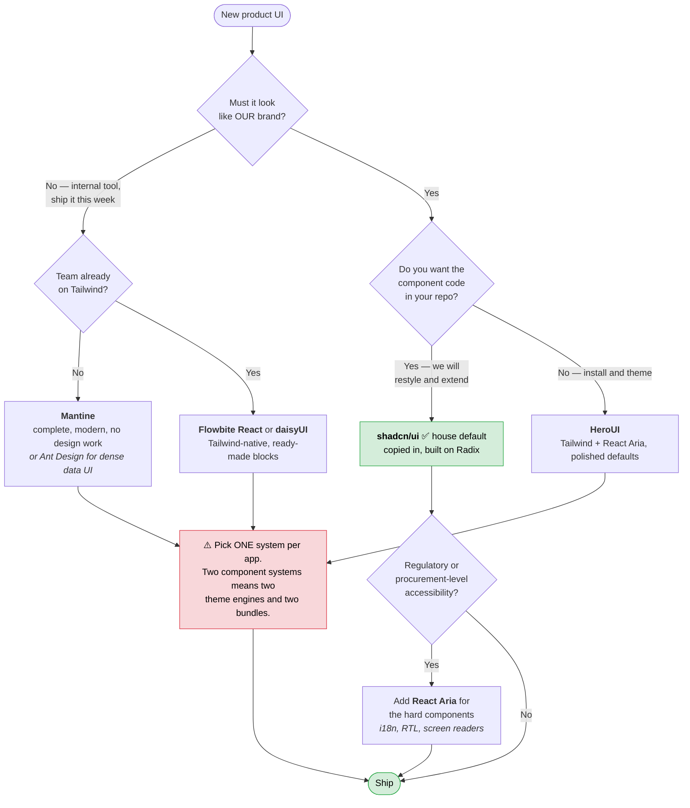

# The Frontend Stack

**How to start a frontend here without starting from scratch.**

The [frontend catalog](./frontend-catalog.md) lists *what exists* — 46 vetted
sources, with licences and maintenance verified. This page is the opinionated
half: *what to pick*, in what order, and what to clone instead of building.

> Read this before your first commit on a new product. Ten minutes here saves
> the fortnight normally spent re-deciding table libraries and re-implementing
> a modal that traps focus incorrectly.

---

## 1. The house default stack

Unless you have a specific reason to deviate, build with this. Every line is a
catalogued source: licence-cleared, monitored, and already used here.

| Layer | Default | Why this one |
| --- | --- | --- |
| Framework | **Next.js** (App Router) | SSR, routing, API handlers and deployment in one decision |
| Styling | **Tailwind CSS** | Utility classes; every component system below assumes it |
| Components | **shadcn/ui** | You own the code — it is copied into your repo, not installed |
| Behaviour underneath | **Radix Primitives** | Accessibility, focus and keyboard handling that shadcn/ui wraps |
| Icons | **Lucide** | The set shadcn/ui assumes; anything else looks subtly wrong |
| Tables | **TanStack Table** + [`data-patterns`](../frontend/data/patterns) | Headless logic; our helpers supply page size, query mapping and formatters |
| Forms | **React Hook Form** + **Zod** + [`data-patterns`](../frontend/data/patterns) | One schema validates the form and the API route |
| Server data | **TanStack Query** | Caching, refetching and retries; removes most reasons to add a state library |
| Client state | **Zustand** | Only for state that is genuinely global and not server data |
| Charts | **Chart.js** + [`chartjs/examples`](../frontend/chartjs/examples) | House presets for palette, axes and tooltips already exist |
| Animation | **Motion** | Beyond CSS transitions only |
| Toasts / drawers / ⌘K | **Sonner** · **Vaul** · **cmdk** | What shadcn/ui's Toaster, Drawer and Command are built on |
| E2E tests | **Playwright** | Sign-up, checkout and billing must not silently break |

```bash
# A new product, the short version
npx create-next-app@latest my-app --typescript --tailwind --app
cd my-app
npx shadcn@latest init
npx shadcn@latest add button card dialog table form sonner
npm i @tanstack/react-table @tanstack/react-query react-hook-form zod @hookform/resolvers lucide-react
```

Then copy the helpers rather than rewriting them — see
[`frontend/data/patterns`](../frontend/data/patterns) for tables, forms and
validation, and [`frontend/shadcn/templates`](../frontend/shadcn/templates) for
`cn()` and the house button/badge variants.

**If you need auth, billing or a database on day one, do not start from
`create-next-app` at all — clone a starter (§3).**

---

## 2. Choosing a component system

The only decision in §1 that is genuinely contested. Answer three questions:



Full comparison, including when each is the *wrong* choice:
[frontend catalog → component systems](./frontend-catalog.md#complete-component-systems).

---

## 3. Starting a product: clone, do not create

Six production starters are **on disk** in this repository at
`frontend/starters/upstream/`, pinned to an exact commit and licence-cleared.
Read them locally, copy the parts you need, or scaffold from them.

| Building… | Start from | What you get for free |
| --- | --- | --- |
| A subscription SaaS | **[Next.js SaaS Starter](../frontend/starters/upstream/saas-starter)** | Stripe checkout, webhooks and customer portal, JWT sessions, Postgres + Drizzle, teams and roles, activity log, dashboard shell |
| A long-lived app, quality first | **[next-enterprise](../frontend/starters/upstream/next-enterprise)** | Strict TS, ESLint/Prettier, Jest + Playwright + Storybook, bundle analysis, full CI |
| A modern app with auth and i18n | **[Next.js Boilerplate](../frontend/starters/upstream/next-js-boilerplate)** | Clerk auth, Drizzle, i18n, Sentry, Pino, Vitest + Playwright — and it is actively maintained |
| A storefront | **[Next.js Commerce](../frontend/starters/upstream/commerce)** | Shopify catalogue, cart, checkout, RSC data flow, SEO product pages |
| Full-stack with typed APIs | **[create-t3-app](../frontend/starters/upstream/create-t3-app)** | tRPC, Prisma/Drizzle, NextAuth, wired end to end |
| Learning how shadcn/ui composes at app scale | **[Taxonomy](../frontend/starters/upstream/taxonomy)** | Marketing site + authenticated dashboard + MDX docs + Stripe, all in shadcn/ui |
| An admin panel that is 80% CRUD | **[Refine](https://refine.dev/docs/)** | Data providers, auth providers, access control, generated screens |

```bash
# Scaffold a new product from a starter (does not carry its git history)
npx degit nextjs/saas-starter my-app
cd my-app && npm install

# Or just read the implementation you need — it is already here, pinned:
ls frontend/starters/upstream/saas-starter/app
```

After cloning: **update the dependencies**. A starter is a snapshot; several
were last pushed months ago (each one's `maintenance_note` in
[`sources.yml`](../sources.yml) says which). The architecture is the value —
the lockfile is not.

> **Multi-tenancy (subdomains per customer):** `vercel/platforms` is the
> best-known reference and **ships no licence**, so it is recorded as blocked
> and must not be copied from. Use the SaaS Starter's team model, or read
> `vercel/platforms` on GitHub for the idea and write the routing yourself.

---

## 4. "I need to build X"

Reach for these before writing anything. Each is catalogued, licence-cleared
and monitored.

| You need | Use | Notes |
| --- | --- | --- |
| A data table | TanStack Table + `clientTable()` from [`data-patterns`](../frontend/data/patterns) | shadcn/ui's data-table block supplies the markup |
| A form | React Hook Form + Zod + `zodForm()` | Same schema on the client and the server |
| Validation anywhere | Zod | Forms, API routes, env vars, LLM output |
| A modal, dropdown, tooltip, tabs | shadcn/ui component (Radix underneath) | Never hand-roll focus trapping |
| A toast | Sonner | `toast.promise()` for async work |
| A mobile sheet / drawer | Vaul | shadcn/ui `<Drawer>` |
| A ⌘K command palette | cmdk | shadcn/ui `<Command>` |
| Resizable split panes | react-resizable-panels | shadcn/ui `<Resizable>` |
| Drag and drop / kanban | dnd kit | Keyboard-accessible, unlike native HTML5 DnD |
| A rich text editor | Tiptap | Check the licence of individual Pro extensions separately |
| Charts | `chartjs/examples` presets, or Recharts for CSS-themed SVG charts | ECharts only for maps/sankey/huge datasets |
| Icons | Lucide | One import per icon |
| Animation | Motion; Magic UI for marketing pages | CSS first for simple transitions |
| Long lists (10k+ rows) | TanStack Virtual | Below ~1000 rows it costs more than it saves |
| Server data fetching | TanStack Query | In RSC apps, fetch on the server first |
| A component workshop | Storybook | Worth it for a shared design system, not for one app |
| End-to-end tests | Playwright | Cover sign-up, checkout, billing |

---

## 5. Rules that keep this cheap

1. **Search this library before installing anything.**
   `npm run vet -- owner/repo` if it is not here yet — and check the
   [catalog](./frontend-catalog.md) first.
2. **One component system per application.** Mixing MUI and shadcn/ui means two
   theme engines, two bundles and a permanently inconsistent UI.
3. **Never hand-roll accessible behaviour.** Dialogs, comboboxes, menus and
   tooltips have focus and ARIA rules you will get wrong. Radix, Headless UI
   and React Aria exist for this.
4. **Extend the internal packages, do not fork them.** If a preset or helper
   nearly fits, change it in
   [`frontend/data/patterns`](../frontend/data/patterns),
   [`frontend/chartjs/examples`](../frontend/chartjs/examples) or
   [`frontend/shadcn/templates`](../frontend/shadcn/templates) with a test.
   The next project then gets it for free.
5. **Never edit anything under `upstream/`.** It is a pinned submodule; the
   edit cannot be committed. Write a wrapper instead.
6. **No licence, no code.** Two repositories in the catalog are blocked for
   exactly this reason. "It is public on GitHub" is not a licence.

---

## 6. New project checklist

```
[ ] Read §1 and deviate only deliberately
[ ] Clone a starter (§3) if you need auth, billing or a database
[ ] npx shadcn@latest init            — components you own
[ ] Copy the helpers you need from frontend/data/patterns
[ ] Copy the chart presets from frontend/chartjs/examples
[ ] npm run vet -- owner/repo         — before adding anything not catalogued
[ ] Playwright covering sign-up and payment before launch
```

---

## Where things live

| What | Where |
| --- | --- |
| The full catalog, generated from the registry | [`docs/frontend-catalog.md`](./frontend-catalog.md) |
| Machine-readable registry (what agents parse) | [`sources.yml`](../sources.yml) |
| Our reusable code | `frontend/*/patterns`, `frontend/*/examples`, `frontend/*/templates` |
| Upstream source, pinned and read-only | `frontend/*/upstream/**` |
| Starters to clone from | `frontend/starters/upstream/**` |
| Rules for AI agents | [`AGENTS.md`](../AGENTS.md) |
